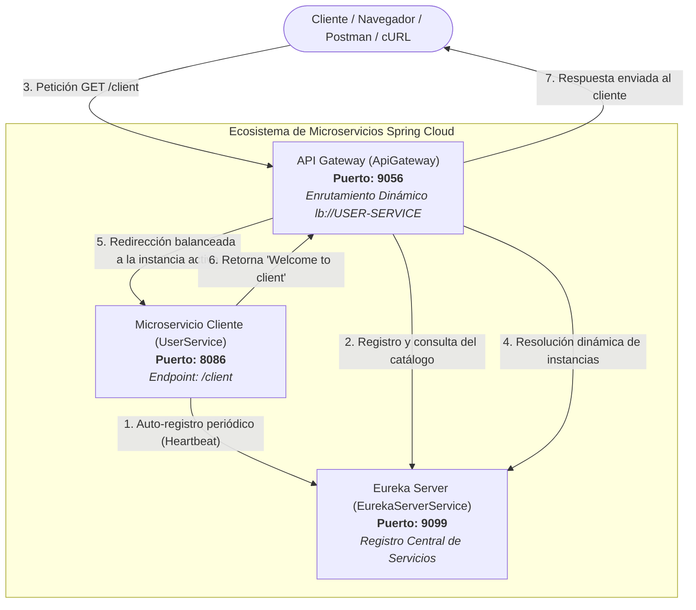

# ENTREGABLE TALLER IMPLEMENTACIÓN SPRING BOOT + EUREKA SERVER & CLIENT + API GATEWAY

* **Autor / Estudiante:** **JOSE DANIEL ZAMBRANO LUNA**
* **Referencia Oficial:** [GeeksforGeeks - Dynamic Routing and Service Discovery in API Gateway](https://www.geeksforgeeks.org/advance-java/dynamic-routing-and-service-discovery-in-api-gateway/)
* **Tecnologías:** Java 21 LTS | Spring Boot 3.3.5 | Spring Cloud 2023.0.3 | Maven 3.9

---

## 1. Descripción del Proyecto y Arquitectura

En una arquitectura moderna basada en microservicios, el **API Gateway** actúa como el punto de entrada unificado y centralizado para todas las peticiones de clientes externos. Al integrarse con un mecanismo de **Service Discovery** (Servidor de Descubrimiento Eureka), el API Gateway descubre automáticamente las instancias activas de cada microservicio en tiempo de ejecución, enrutando el tráfico de manera dinámica mediante balanceo de carga (`lb://`) sin requerir URLs codificadas en duro (*hardcoded*).

### Diagrama de Arquitectura y Flujo de Comunicación



---

## 2. Estructura del Proyecto

El proyecto está organizado en una arquitectura multimódulo Maven limpia e independiente:

```text
taller-eureka-gateway/
├── pom.xml                               # POM agregador raíz
├── run-all.bat                           # Script Windows para iniciar los 3 servicios en terminales independientes
├── test-services.ps1                     # Script PowerShell para verificación automatizada de endpoints
├── INFORME_ENTREGABLE_TALLER_EUREKA_GATEWAY.docx  # Documento formal del informe de entrega
├── README.md                             # Documentación técnica completa
│
├── EurekaServerService/                  # MÓDULO 1: Eureka Server (Registro)
│   ├── pom.xml
│   └── src/main/
│       ├── java/org/example/eurekaserverservice/
│       │   └── EurekaServerServiceApplication.java
│       └── resources/
│           └── application.properties
│
├── UserService/                          # MÓDULO 2: Microservicio de Usuario (Eureka Client)
│   ├── pom.xml
│   └── src/main/
│       ├── java/org/example/userservice/
│       │   ├── UserController.java
│       │   └── UserServiceApplication.java
│       └── resources/
│           └── application.properties
│
└── ApiGateway/                           # MÓDULO 3: Spring Cloud API Gateway (Enrutador Dinámico)
    ├── pom.xml
    └── src/main/
        ├── java/org/example/apigateway/
        │   └── ApiGatewayApplication.java
        └── resources/
            └── application.yml
```

---

## 3. Especificación Técnica de los Módulos

### 3.1 Módulo 1: EurekaServerService (Eureka Server)
* **Propósito**: Servidor centralizado de nombres y registro donde se publican las instancias de los servicios.
* **Puerto**: `9099`
* **Dependencias principales**:
  * `spring-boot-starter-web`
  * `spring-cloud-starter-netflix-eureka-server`
  * `spring-boot-devtools`
  * `lombok`
* **Anotación clave**: `@EnableEurekaServer` en `EurekaServerServiceApplication.java`.
* **Configuración (`application.properties`)**:
  ```properties
  spring.application.name=EurekaServerService
  server.port=9099
  eureka.instance.hostname=localhost
  eureka.client.register-with-eureka=false
  eureka.client.fetch-registry=false
  eureka.client.service-url.defaultZone=http://${eureka.instance.hostname}:${server.port}/eureka
  ```

---

### 3.2 Módulo 2: UserService (Eureka Client)
* **Propósito**: Microservicio de negocio que expone endpoints REST y se registra como cliente ante Eureka.
* **Puerto**: `8086`
* **Dependencias principales**:
  * `spring-boot-starter-web`
  * `spring-cloud-starter-netflix-eureka-client`
  * `spring-boot-devtools`
  * `lombok`
* **Anotación clave**: `@EnableDiscoveryClient` en `UserServiceApplication.java`.
* **Configuración (`application.properties`)**:
  ```properties
  spring.application.name=user-service
  server.port=8086
  eureka.instance.prefer-ip-address=true
  eureka.client.fetch-registry=true
  eureka.client.register-with-eureka=true
  eureka.client.service-url.defaultZone=http://localhost:9099/eureka
  ```
* **Controlador REST (`UserController.java`)**:
  ```java
  package org.example.userservice;

  import org.springframework.web.bind.annotation.GetMapping;
  import org.springframework.web.bind.annotation.RestController;

  @RestController
  public class UserController {

      @GetMapping("/client")
      public String check() {
          return "Welcome to client";
      }
  }
  ```

---

### 3.3 Módulo 3: ApiGateway (Spring Cloud Gateway)
* **Propósito**: Puerta de enlace que intercepta las peticiones de los clientes, consulta el registro de Eureka y despacha dinámicamente hacia `user-service`.
* **Puerto**: `9056`
* **Dependencias principales**:
  * `spring-cloud-starter-gateway`
  * `spring-cloud-starter-netflix-eureka-client`
  * `spring-cloud-starter-loadbalancer`
  * `spring-boot-devtools`
  * `lombok`
* **Anotación clave**: `@EnableDiscoveryClient` en `ApiGatewayApplication.java`.
* **Configuración (`application.yml`)**:
  ```yaml
  server:
    port: 9056

  spring:
    application:
      name: API-GATEWAY
    cloud:
      gateway:
        routes:
          - id: USER-SERVICE
            uri: lb://USER-SERVICE
            predicates:
              - Path=/client/**, /client
        default-filters:
          - DedupeResponseHeader=Access-Control-Allow-Credentials Access-Control-Allow-Origin
        globalcors:
          cors-configurations:
            '[/**]':
              allowedOrigins: "*"
              allowedMethods: "*"
              allowedHeaders: "*"

  eureka:
    client:
      register-with-eureka: true
      fetch-registry: true
      service-url:
        defaultZone: http://localhost:9099/eureka
    instance:
      prefer-ip-address: true
  ```

---

## 4. Instrucciones de Compilación y Ejecución

### Requisitos Previos
* **Java JDK**: Versión 17 o 21 LTS (Probado y verificado con Java 21).
* **Apache Maven**: Versión 3.8+ o 3.9+.

### Paso 1: Compilar y empaquetar el proyecto completo
En la raíz de la carpeta `taller-eureka-gateway`, ejecuta:
```bash
mvn clean package -DskipTests
```
Esto generará los archivos `.jar` ejecutables dentro del directorio `target/` de cada módulo:
1. `EurekaServerService/target/EurekaServerService-0.0.1-SNAPSHOT.jar`
2. `UserService/target/UserService-0.0.1-SNAPSHOT.jar`
3. `ApiGateway/target/ApiGateway-0.0.1-SNAPSHOT.jar`

---

### Paso 2: Ejecutar los Servicios

#### Opción A (Automática mediante Script Windows):
Haz doble clic en `run-all.bat` o ejecútalo desde la terminal:
```cmd
run-all.bat
```
El script iniciará automáticamente:
1. Eureka Server en el puerto 9099.
2. Esperará 12 segundos para su estabilización.
3. UserService en el puerto 8086.
4. Esperará 6 segundos.
5. ApiGateway en el puerto 9056.

#### Opción B (Manual en 3 terminales separadas en orden estricto):

* **Terminal 1 - Iniciar Eureka Server:**
  ```cmd
  cd EurekaServerService
  java -jar target/EurekaServerService-0.0.1-SNAPSHOT.jar
  ```
  *(Esperar ~10 segundos hasta que indique `Started EurekaServerServiceApplication` en el puerto 9099)*

* **Terminal 2 - Iniciar UserService:**
  ```cmd
  cd UserService
  java -jar target/UserService-0.0.1-SNAPSHOT.jar
  ```
  *(Se registrará en Eureka Server en el puerto 8086)*

* **Terminal 3 - Iniciar ApiGateway:**
  ```cmd
  cd ApiGateway
  java -jar target/ApiGateway-0.0.1-SNAPSHOT.jar
  ```
  *(Se registrará en Eureka Server y escuchará en el puerto 9056)*

---

## 5. Pruebas y Evidencias de Funcionamiento

### Prueba 1: Acceso Directo al Microservicio (UserService)
Verifica que el servicio base responde localmente:
* **URL**: `http://localhost:8086/client`
* **Método**: `GET`
* **Comando PowerShell**:
  ```powershell
  Invoke-RestMethod -Uri "http://localhost:8086/client" -Method Get
  ```
* **Resultado Obtenido**:
  ```text
  Welcome to client
  ```

---

### Prueba 2: Enrutamiento Dinámico vía API Gateway (Dynamic Routing)
Verifica que el API Gateway intercepta la ruta `/client`, consulta a Eureka por `USER-SERVICE` y despacha la petición transparentemente:
* **URL**: `http://localhost:9056/client`
* **Método**: `GET`
* **Comando PowerShell**:
  ```powershell
  Invoke-RestMethod -Uri "http://localhost:9056/client" -Method Get
  ```
* **Resultado Obtenido**:
  ```text
  Welcome to client
  ```
> **Nota de Arquitectura**: El cliente externo **nunca** conoce la IP ni el puerto del microservicio final (8086), solo interactúa con el Gateway (9056).

---

### Prueba 3: Panel de Control de Eureka Server (Eureka Dashboard)
* Abre un navegador web en: [http://localhost:9099](http://localhost:9099)
* En la tabla **"Instances currently registered with Eureka"**, se constata la presencia de ambos microservicios en estado `UP`:
  * `API-GATEWAY` (1 instancia)
  * `USER-SERVICE` (1 instancia)

* O mediante la API REST de Eureka:
  ```powershell
  Invoke-RestMethod -Uri "http://localhost:9099/eureka/apps" -Headers @{ "Accept" = "application/json" } -Method Get
  ```

---

### Prueba Automatizada con el Script de Validación
Puedes ejecutar en cualquier momento el script PowerShell incluido:
```powershell
.\test-services.ps1
```
Salida en consola obtenida:
```text
==========================================================
  TEST AUTOMATIZADO - TALLER SPRING BOOT + EUREKA + GATEWAY
==========================================================

[1] Verificando Eureka Server (http://localhost:9099/eureka/apps)...
 [OK] Eureka Server esta activo. Servicios registrados:
      - API-GATEWAY (Instancias: 1, Estado: UP)
      - USER-SERVICE (Instancias: 1, Estado: UP)

[2] Verificando Endpoint Directo de UserService (http://localhost:8086/client)...
 [OK] Respuesta directa de UserService recibida:
      Contenido: "Welcome to client"

[3] Verificando Enrutamiento Dinamico via API Gateway (http://localhost:9056/client)...
 [OK] Dynamic Routing via API Gateway exitoso:
      Contenido: "Welcome to client"

==========================================================
  FIN DE PRUEBAS
==========================================================
```

---

## 6. Conclusiones y Aprendizaje

1. **Desacoplamiento Total**: La integración de Spring Cloud Gateway con Eureka Server elimina la necesidad de mantener direcciones IP y puertos estáticos en el enrutamiento.
2. **Escalabilidad Horizontal**: Si se levantan múltiples instancias de `UserService` en diferentes puertos (e.g. 8087, 8088), el Gateway balanceará automáticamente la carga sin cambios de configuración gracias a `lb://USER-SERVICE`.
3. **Resiliencia y Descubrimiento en Tiempo Real**: Si una instancia falla o se desconecta, Eureka actualiza el registro tras el latido (*heartbeat*) y el Gateway redirige el tráfico únicamente a instancias operativas.
